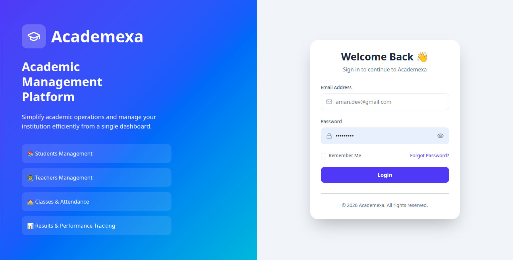
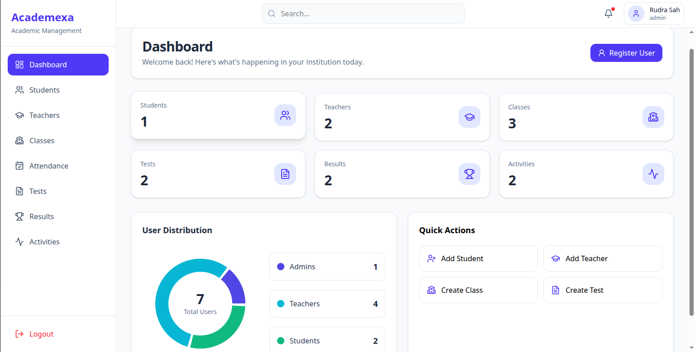
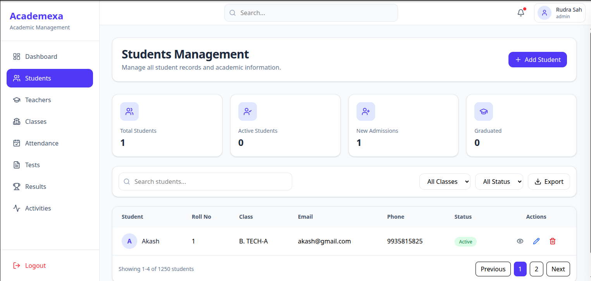
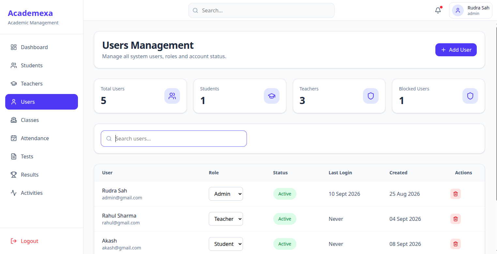
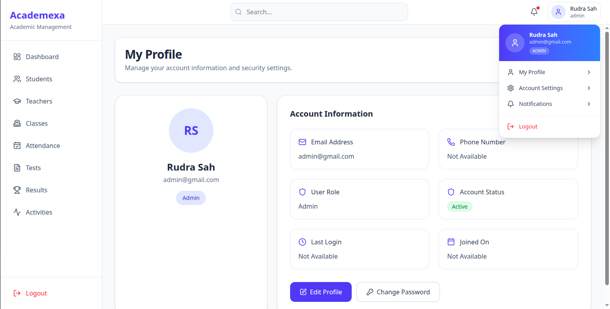

# 🎓 Academic Management Portal

🚧 A full-stack MERN-based Academic Management Portal currently under development.

The Academic Management Portal is designed to streamline and digitize academic institution operations, including student management, teacher management, class administration, attendance tracking, examinations, results, and extracurricular activities.

---

## 🚀 Tech Stack

### Frontend

* React
* Vite
* React Router DOM
* Axios
* Tailwind CSS

### Backend

* Node.js
* Express.js
* MongoDB
* Mongoose
* JWT Authentication
* Argon2 Password Hashing
* Joi Validation

---

## ✨ Features

### Authentication & Authorization

* User Registration
* User Login & Logout
* JWT-Based Authentication
* Forgot Password
* Reset Password via Email
* Change Password
* JWT Cookie Authentication
* Role-Based Access Control (Admin, Teacher, Student)

### Student Management

* Create Student
* View Student Details
* Update Student Information
* Delete Student

### Teacher Management

* Create Teacher
* View Teacher Details
* Update Teacher Information
* Delete Teacher

### Class Management

* Create Class
* Assign Class Teacher
* Update Class Information
* Delete Class

### Attendance Management

* Mark Attendance
* View Attendance Records
* Update Attendance
* Delete Attendance Records

### Test Management

* Create Tests
* Manage Examination Details
* Update Test Information
* Delete Tests

### Result Management

* Record Student Results
* Update Result Records
* View Performance Data
* Delete Results

### Activity Management

* Create Activities
* Manage School Events
* Track Participation
* Update Activity Information
* Delete Activities

### Dashboard

* Institution Statistics
* User Distribution Analytics
* Recent Activities
* Quick Actions
* Student Overview
* Teacher Overview

---

## 📦 Installation

### Clone Repository

```bash
git clone https://github.com/aman-gupt1/academic-management-portel

```

```bash
cd academic-management-portal
```

---

## 🔧 Backend Setup

Navigate to backend folder:

```bash
cd server
```

Install dependencies:

```bash
npm install
```

Create a `.env` file:

```env
PORT=5000
MONGO_URI=your_mongodb_connection_string

JWT_SECRET=your_jwt_secret
JWT_EXPIRE=7d

NODE_ENV=development

EMAIL_USER=your_email@gmail.com

EMAIL_PASS=your_gmail_app_password

CLIENT_URL=http://localhost:5173

NODE_ENV=development

```

Run backend server:

```bash
npm run dev
```

Backend runs on:

```text
http://localhost:5000
```

---

## 💻 Frontend Setup

Navigate to frontend folder:

```bash
cd client
```

Install dependencies:

```bash
npm install
```

Run development server:

```bash
npm run dev
```

Frontend runs on:

```text
http://localhost:5173
```

---

## 📡 API Overview

### Authentication

* Register User
* Login User
* Logout User
* Forgot Password
* Reset Password

### Users

* Get Profile
* Change Password
* Get User Distribution

### Students

* Create Student
* Get Students
* Get Student By ID
* Update Student
* Delete Student

### Teachers

* Create Teacher
* Get Teachers
* Get Teacher By ID
* Update Teacher
* Delete Teacher

### Classes

* Create Class
* Get Classes
* Get Class By ID
* Update Class
* Delete Class

### Attendance

* Create Attendance
* Get Attendance
* Update Attendance
* Delete Attendance

### Tests

* Create Test
* Get Tests
* Update Test
* Delete Test

### Results

* Create Result
* Get Results
* Update Result
* Delete Result

### Activities

* Create Activity
* Get Activities
* Update Activity
* Delete Activity

---

## 🎯 Current Status

### Completed Modules

* Authentication APIs
* Forgot Password Flow
* Reset Password Flow
* Change Password
* User Management
* Student Management
* Teacher Management
* Class Management
* Attendance Management
* Test Management
* Result Management
* Activity Management
* Dashboard Statistics
* User Distribution Analytics
* Frontend CRUD Operations

### In Progress

* Advanced Dashboard Analytics
* Notifications
* Reports & Export Features
* Performance Optimizations

## 📸 Screenshots

### Login Page



### Dashboard



### Students Management



### Users Management



### Profile Page



---

## 📂 Project Structure

academic-management-portal/

├── client/

│ ├── src/

│ ├── components/

│ ├── pages/

│ └── api/

│

├── server/

│ ├── src/

│ │ ├── controllers/

│ │ ├── services/

│ │ ├── models/

│ │ ├── routes/

│ │ ├── middleware/

│ │ ├── validations/

│ │ └── utils/

│

└── README.md

---

## 🤝 Contributing

This project is currently maintained by the repository owner.

Issues, suggestions, and feedback are welcome.

---

## ⭐ Support

If you find this project useful, consider giving it a star on GitHub.

---

## 📄 License

This project is licensed under the MIT License.

